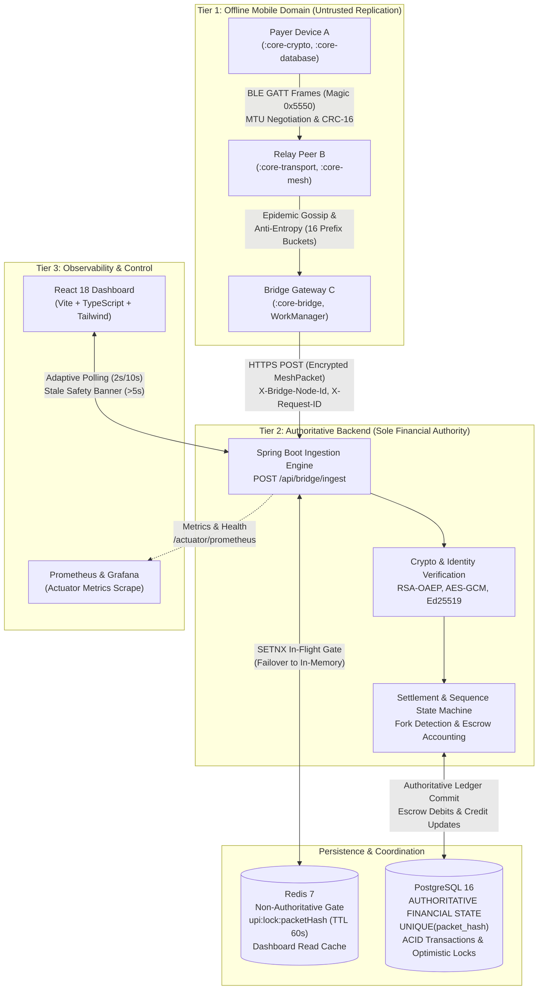
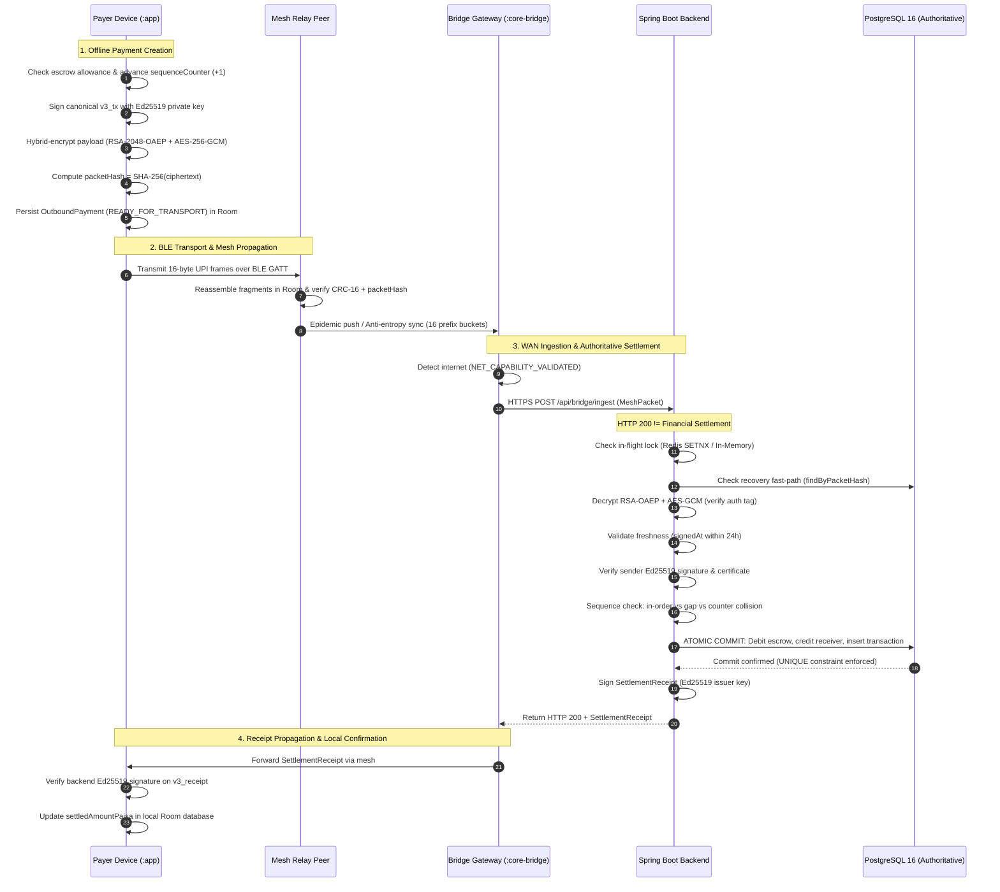

# UPI Without Internet — Offline Distributed Payment System

An offline-first distributed payment prototype implementing cryptographic offline wallet authorization, peer-to-peer BLE mesh gossip with anti-entropy synchronization, and deferred authoritative settlement via WAN bridge gateways to an idempotent Spring Boot and PostgreSQL ledger.


---

## 1. Overview

Standard digital payment architectures (e.g., standard UPI) require continuous, real-time bidirectional connectivity between the payer's mobile device, payment switches (such as NPCI), and issuing/acquiring bank cores at the moment of payment creation. In environments with zero or intermittent network coverage—such as underground transit, basements, remote rural areas, disaster zones, or congested public gatherings—traditional digital payments completely fail.

Ordinary online payment protocols cannot simply be deployed offline:
- Without direct access to an authoritative ledger, an untrusted client cannot verify whether a payer has sufficient funds or has already spent those funds elsewhere.
- An offline payer could clone an application or replay previously signed payment instructions.
- Intermediary nodes forwarding transactions across an ad-hoc mesh could inspect, tamper with, or drop payment data.

This project implements a **mesh-routed deferred settlement system**:
1. **Offline Wallet Authorization:** A payer signs an authenticated payment instruction against a pre-allocated, server-signed offline escrow allowance using an internal monotonic sequence counter.
2. **Untrusted BLE Mesh Propagation:** The encrypted payment packet propagates hop-by-hop across nearby peer devices using Bluetooth Low Energy (BLE) GATT framing, epidemic gossip, and deterministic anti-entropy synchronization.
3. **WAN Gateway Ingestion:** When any peer with the packet encounters an active internet connection, it acts as an untrusted WAN bridge, uploading the packet to the central backend.
4. **Authoritative Backend Settlement:** The backend verifies cryptographic signatures, detects sequence forks or duplicate deliveries, debits the sender's escrow account, credits the recipient, commits the transaction to an ACID PostgreSQL ledger, and issues an Ed25519-signed settlement receipt.

> **Crucial Financial Boundary:**  
> **PostgreSQL and the Spring Boot backend remain the sole financial authority.**  
> Android devices, BLE transports, Room databases, and mesh gossip layers operate strictly as non-authoritative replication and execution caches. Receiving a packet locally or observing an HTTP 200 upload response does **not** constitute financial settlement. Settlement occurs only when committed to the authoritative PostgreSQL database.

---

## 2. What Makes This Project Interesting

This repository focuses on distributed systems, applied cryptography, and fintech reliability engineering:

- **Offline Spending Authorization:** Escrow-backed offline wallets with server-signed certificates bounding total authorized financial exposure.
- **Cryptographic Identity & Privacy:** End-to-end payload confidentiality and tamper-proofing via hybrid encryption (RSA-2048-OAEP + AES-256-GCM) combined with sender authorization via Ed25519 digital signatures.
- **Durable Local State:** AndroidX Room/SQLite persistence storing local wallet balances in integer paisa (`Long`), tracking immutable outbound intents, and managing fragmented packets across application restarts.
- **Custom BLE GATT Framing:** A 16-byte binary framing protocol with magic bytes, transfer tracking, CRC-16-CCITT integrity checks, and dynamic ATT MTU payload calculation ($M - 19$).
- **Hybrid Mesh Synchronization:** Combines fast epidemic push gossip (TTL-bounded) with deterministic anti-entropy pull (root state digests and 16 prefix-bucket checksums) to heal network partitions without central coordination.
- **Multi-Tier Duplicate Suppression:** Fast-path deduplication via Redis distributed locks and in-memory gates, backed by a hard relational `UNIQUE(packet_hash)` database constraint.
- **Monotonic Sequence Fork Detection:** Server-side state machine that detects counter collisions, distinguishes out-of-order sequence gaps from double-spend attempts, freezes disputed wallets (`LOCKED_DISPUTED`), and records auditable dispute records.
- **Cryptographically Signed Receipts:** Settlement proof generated exclusively by the backend issuer key over canonical receipt bytes (`v3_receipt`), verified by Android clients before marking funds settled.
- **Deterministic Fault Injection:** An in-memory chaos engineering engine supporting 13 transport, network, and persistence fault types to rigorously validate machine-checkable invariants (I1–I12).
- **Production Observability:** Micrometer metrics, bounded-cardinality tags, custom Actuator health indicators (`UP`, `DEGRADED`, `DOWN`), structured MDC logging with `X-Request-ID`, and pre-configured Prometheus/Grafana dashboards.

---

## 3. Architecture



---

## 4. End-to-End Payment Flow



---

## 5. Cryptographic Security

The cryptographic architecture guarantees payload confidentiality, tamper evidence, sender authorization, and replay protection across untrusted intermediary hops:

| Purpose | Mechanism | Implementation Details |
|---|---|---|
| **Payload Confidentiality** | Hybrid Encryption | RSA-2048-OAEP (SHA-256, MGF1-SHA-256) unwraps an ephemeral 256-bit AES key. |
| **Payload Integrity** | Authenticated Encryption | AES-256-GCM with a unique 12-byte IV and 128-bit authentication tag. Any bit modification causes decryption failure. |
| **Sender Authorization** | Digital Signatures | Ed25519 (RFC 8032). 64-byte signature over canonical transaction bytes; verified against sender's registered public key. |
| **Content Identity** | SHA-256 Hash | `packetHash = SHA-256(ciphertext)`. Immutable identifier used for mesh sync, deduplication, and database uniqueness. |
| **Replay Protection** | Nonce + Timestamp Window | 128-bit random UUID nonce combined with a strict 24-hour timestamp validity window (`signedAt`). |
| **Key Storage at Rest** | Android Keystore | Device Ed25519 private keys are encrypted at rest using AES-256-GCM under a non-exportable master key (`upi_mesh_master_key`). |
| **Issuer Authority** | Server Issuer Key | Backend maintains an Ed25519 issuer keypair to sign offline certificates and settlement receipts. |

### Canonical Serialization Formats
All signatures are computed over deterministic UTF-8 pipe-delimited strings:
- **Transaction (`v3_tx`):** `v3_tx|walletId=...|counter=...|amountPaisa=...|senderVpa=...|receiverVpa=...|nonce=...|signedAt=...`
- **Certificate (`v1_cert`):** `v1_cert|walletId=...|ownerVpa=...|ownerPublicKey=...|allocatedAmount=...|walletEpoch=...|validFrom=...|validUntil=...|initialCounter=...`
- **Receipt (`v3_receipt`):** `v3_receipt|txId=...|packetHash=...|walletId=...|counter=...|status=...|settledAt=...`

---

## 6. Offline Wallet & Escrow Accounting

### The Escrow Accounting Equation
To guarantee that money cannot be created out of thin air while offline, the system enforces a strict balance conservation invariant:
$$\text{Total Account Funds} = \text{Liquid Available Balance} + \text{Offline Locked Escrow Balance}$$

1. **Allocation:** When ₹X is allocated to an offline wallet, ₹X is debited from the liquid balance and credited to `offlineLockedBalance`. The server issues an `OfflineWalletCertificate` signed with its Ed25519 issuer key.
2. **Offline Spending:** The payer device increments its monotonic `sequenceCounter` and decrements its local spendable allowance.
3. **Settlement:** Upon ingestion, the backend debits ₹amount from `offlineLockedBalance` and credits the payee’s liquid balance. The payer’s liquid balance is never debited twice.
4. **Reconciliation:** Unused escrow ($\text{allocatedAmount} - \text{settledAmount}$) is returned to the payer's liquid balance when the wallet is reconciled or expires.

### Monotonic Sequence State Machine

```
               [ Incoming Transaction (Counter N) ]
                                │
        ┌───────────────────────┼────────────────────────┐
        ▼                       ▼                        ▼
  N == LastSettled + 1    N > LastSettled + 1      N <= LastSettled
   (In-Order Delivery)      (Sequence Gap)        (Duplicate or Fork)
        │                       │                        │
  Debit escrow &          Stage as                 Same packetHash?
  credit receiver.        PENDING_SEQUENCE_GAP     ├── YES: Return committed record
  Advance LastSettled.    (30-min window).         └── NO:  DOUBLE-SPEND DETECTED!
  Issue signed receipt.                                     Mark CONFLICTING.
                                                            Freeze wallet to
                                                            LOCKED_DISPUTED.
```

> **Terminal Transfer Policy:**  
> Offline value transfers are strictly **Payer $\to$ Payee $\to$ Backend**. A payee cannot re-spend received offline funds offline without prior backend settlement.

---

## 7. BLE Transport Layer

The `:core-transport` module provides a point-to-point BLE transport layer implementing custom binary framing, dynamic ATT MTU negotiation, and Room-backed reassembly.

### Approved 128-Bit Service & Characteristic UUIDs
- **Service UUID:** `e8a30001-7c2b-4e6a-a83d-3b9e8a9f24c0`
- **Control Point:** `e8a30002-7c2b-4e6a-a83d-3b9e8a9f24c0` (Write / Notify)
- **Packet Transfer:** `e8a30003-7c2b-4e6a-a83d-3b9e8a9f24c0` (Write Without Response / Notify)
- **State Summary:** `e8a30004-7c2b-4e6a-a83d-3b9e8a9f24c0` (Read / Notify)

### 16-Byte Fixed UPI Frame Header
Every BLE transmission chunk is prefixed with an exact 16-byte binary header:

```
 0                   1                   2                   3
 0 1 2 3 4 5 6 7 8 9 0 1 2 3 4 5 6 7 8 9 0 1 2 3 4 5 6 7 8 9 0 1
+-+-+-+-+-+-+-+-+-+-+-+-+-+-+-+-+-+-+-+-+-+-+-+-+-+-+-+-+-+-+-+-+
|          Magic (0x5550)       |    Version    |  MessageType  |
+-+-+-+-+-+-+-+-+-+-+-+-+-+-+-+-+-+-+-+-+-+-+-+-+-+-+-+-+-+-+-+-+
|     Flags     | FragmentIndex | TotalFragments|  TransferId   |
+-+-+-+-+-+-+-+-+-+-+-+-+-+-+-+-+-+-+-+-+-+-+-+-+-+-+-+-+-+-+-+-+
|       TransferId (cont)       |      PacketHashPrefix (24b)   |
+-+-+-+-+-+-+-+-+-+-+-+-+-+-+-+-+-+-+-+-+-+-+-+-+-+-+-+-+-+-+-+-+
| PacketHash (c)|     PayloadLength (16b)       |  CRC16-CCITT  |
+-+-+-+-+-+-+-+-+-+-+-+-+-+-+-+-+-+-+-+-+-+-+-+-+-+-+-+-+-+-+-+-+
|                       Payload (0..N bytes)                    |
+-+-+-+-+-+-+-+-+-+-+-+-+-+-+-+-+-+-+-+-+-+-+-+-+-+-+-+-+-+-+-+-+
```

- **ATT MTU Payload Calculation:** $\text{Effective Payload} = M - 3\text{ (ATT overhead)} - 16\text{ (UPI header)} = M - 19$ bytes.
- **Fragmentation Bounds:** Negotiated MTU ranges from 64 to 517 bytes. Maximum 64 fragments per packet.
- **Reassembly:** Chunks persist into Room `PacketFragmentDao` across application restarts. Complete reassembly validates CRC-16-CCITT and matches the reassembled payload's SHA-256 against `packetHash`.
- **Hardware Failure Semantics:** The concrete `AndroidBlePlatformDriver` contains zero silent in-memory fallbacks. Permission denials, missing adapters, or GATT connection drops immediately raise explicit exceptions (`BleProtocolException`).

---

## 8. Mesh Gossip & Anti-Entropy Protocol

The `:core-mesh` module coordinates peer-to-peer packet replication across reachable devices without requiring internet access.

### Epidemic Push (Fast Hop Propagation)
When a device creates or receives a new packet, it pushes the packet to all connected BLE neighbors with a decremented Time-To-Live (TTL). When `TTL == 0`, epidemic push halts.

### Deterministic Anti-Entropy Pull (State Reconciliation)
To heal partitions and recover packets whose push TTL expired, devices periodically execute pairwise anti-entropy:
1. **State Digest:** Each node computes a deterministic digest by lexicographically sorting all held `packetHash`es and hashing the concatenation with SHA-256 (`SHA-256("EMPTY")` if empty).
2. **16 Prefix Buckets:** Hashes are partitioned into 16 buckets based on their first hexadecimal character (`0`–`f`).
3. **Summary Exchange:** Nodes exchange `StateSummaryMessage`. If digests match, synchronization terminates in $O(1)$ time.
4. **Bucket Hash Exchange:** If digests differ, nodes exchange full hashes only for divergent buckets (`BucketHashExchangeMessage`).
5. **Set Difference & Bounded Sync:** Nodes compute symmetric set differences (`missingFromPeer` / `missingFromSelf`) and stream missing packets in bounded batches of up to 50 items (`SyncRequestMessage` $\to$ `SyncResponseMessage` $\to$ `SyncAckMessage`).

> **Distributed Systems Clarification:**  
> The mesh protocol provides **eventual state convergence** between reachable peers. It does **not** provide distributed consensus, linearizability, or global transaction ordering.

---

## 9. WAN Bridge Ingestion Layer

The `:core-bridge` module enables internet-connected Android devices to act as untrusted gateways:
- **Connectivity Detection:** Uses Android `ConnectivityManager` to monitor network capabilities, requiring both `NET_CAPABILITY_INTERNET` and `NET_CAPABILITY_VALIDATED`.
- **Queue & Leasing:** Replicated packets in Room are scheduled via `WanQueueManager` with concurrency leases to prevent duplicate simultaneous uploads.
- **Background Uploads:** Uses Android `WorkManager` (`WanUploadWorker`) with exponential backoff and jitter for OS-managed background synchronization.
- **Untrusted Forwarder Model:** The bridge cannot decrypt the payload or alter transaction data. HTTP 200 indicates backend delivery, **never** financial settlement.
- **Receipt Validation:** Upon receiving a backend response, `BridgeReceiptValidator` cryptographically verifies the server's Ed25519 signature over canonical `v3_receipt` before any local settlement update occurs.

---

## 10. Backend Financial Authority

The Spring Boot backend is the sole authority governing the financial ledger. When a packet arrives at `/api/bridge/ingest`, it executes through a strict processing pipeline:

```
[ Ingest Request ]
       │
       ▼
 1. SHA-256 Content Hash ─────────► Compute packetHash = SHA-256(ciphertext)
       │
       ▼
 2. In-Flight Gate ───────────────► Redis SETNX upi:lock:<hash> (60s TTL)
       │                            (Rejects concurrent duplicate uploads immediately)
       ▼
 3. Recovery Fast-Path ───────────► Check PostgreSQL findByPacketHash
       │                            (If already committed, return existing record)
       ▼
 4. Hybrid Decryption ────────────► RSA-2048-OAEP unwraps AES key; AES-256-GCM decrypts
       │                            (Authentication tag failure = immediate rejection)
       ▼
 5. Freshness Validation ─────────► Verify signedAt is within the last 24 hours
       │
       ▼
 6. Signature & Cert Check ───────► Verify sender Ed25519 signature on v3_tx &
       │                            validate server-signed OfflineWalletCertificate
       ▼
 7. Sequence State Machine ───────► In-order vs Sequence Gap vs Counter Collision
       │
       ▼
 8. Atomic Settlement ────────────► PostgreSQL ACID transaction (@Version optimistic lock):
       │                            Debit sender escrow, credit receiver liquid balance,
       │                            insert into transactions table (UNIQUE packet_hash)
       ▼
 9. Authoritative Receipt ────────► Sign SettlementReceipt with server Ed25519 issuer key
```

---

## 11. PostgreSQL + Redis

The infrastructure enforces a strict separation between authoritative persistence and non-authoritative coordination:

| Dimension | PostgreSQL 16 (Authoritative) | Redis 7 (Non-Authoritative) |
|---|---|---|
| **Role** | Master financial ledger & source of truth | In-flight coordination gate & read cache |
| **Constraints** | Hard DB `UNIQUE(packet_hash)`, `CHECK (balance >= 0)` | Key expiry (TTL 60s in-flight, 24h completion) |
| **Persistence** | Durable disk storage with Flyway migrations | Ephemeral in-memory data store with snapshotting |
| **Failure Mode** | If down, the backend reports `DOWN` and halts writes | If down, backend logs warning, reports `DEGRADED`, and falls back to local in-memory gate |
| **Financial Authority**| **Absolute.** Balances and transactions live here | **Zero.** Redis outage never causes duplicate settlement |

---

## 12. Fault Injection & Reliability Framework

The backend includes a deterministic chaos engineering framework operating at transport, control, and exception boundaries. It never directly mutates balances or database entities.

### 13 Supported Fault Categories
1. **Network Layer:** `DROP` (packet loss), `DUPLICATE` (transmission duplication), `DELAY` (latency injection), `REORDER` (sequence inversion), `PARTITION` (link severance), `PEER_UNAVAILABLE` (node dropouts).
2. **Bridge Layer:** `BRIDGE_UNAVAILABLE` (WAN upload failure), `STALE_RESPONSE` (dropped HTTP response after settlement), `DUPLICATE_REQUEST` (concurrent identical submissions).
3. **Control & Payload Layer:** `MALFORMED_SYNC_MESSAGE` (corrupted sync envelopes), `CORRUPTED_PACKET_PAYLOAD` (tampered ciphertext bytes).
4. **Persistence & Node Layer:** `TRANSIENT_DATABASE_FAILURE` (optimistic lock collisions triggering retry backoff), `CRASH_AND_RESTART` (volatile buffer reset followed by anti-entropy recovery).

---

## 13. Machine-Checkable Invariants

The backend continuously audits 12 formal invariants across all operations:

| ID | Invariant Name | Architectural Purpose |
|---|---|---|
| **I1** | **Packet Identity** | Guarantees `packetHash == SHA-256(ciphertext)` across all nodes. |
| **I2** | **Transport Deduplication** | At most 1 entry per packet hash in any node buffer. |
| **I3** | **Settlement Idempotency** | At most 1 committed settlement record per packet hash in PostgreSQL. |
| **I4** | **Funds Conservation** | $\sum \text{liquidBalance} + \sum \text{offlineLockedBalance} \equiv \text{InitialTotalFunds}$. |
| **I5** | **Non-Negative Escrow** | Wallet remaining escrow balance is strictly $\ge 0$. |
| **I6** | **Observable Conflict** | Counter collisions are recorded as `CONFLICTING` and freeze wallets into `LOCKED_DISPUTED`. |
| **I7** | **Connected Convergence** | Reachable connected nodes achieve identical `stateDigest` after anti-entropy. |
| **I8** | **TTL Independence** | Anti-entropy synchronizes packets even after push TTL has expired. |
| **I9** | **Transient Recoverability**| Transient DB errors release in-flight locks to allow valid retries. |
| **I10**| **Permanent Terminality** | Validation failures terminate cleanly without infinite retry loops. |
| **I11**| **Crash Non-Mutation** | Node crash/restart does not alter the backend financial ledger. |
| **I12**| **Cryptographic Barrier** | Corrupted or unauthenticated packets are unconditionally rejected before ledger access. |

---

## 14. Observability

- **Metrics & Actuator:** Micrometer metrics exposed at `/actuator/prometheus`. Bounded tag cardinality ensures high-cardinality values (such as `packetHash` or `vpa`) are never used as metric tags.
- **Health Model:** `/actuator/health` exposes a custom health indicator:
  - `UP` (HTTP 200): PostgreSQL and Redis are healthy.
  - `DEGRADED` (HTTP 200): PostgreSQL is healthy, Redis is unavailable (operating in fallback mode).
  - `DOWN` (HTTP 503): PostgreSQL is unreachable; financial mutations are safely blocked.
- **Structured Tracing:** `CorrelationIdFilter` assigns or propagates an `X-Request-ID` header, injected into SLF4J MDC `[req:<id>]` and echoed in response headers.
- **Pre-Configured Grafana Dashboards:**
  1. `01 - System Overview`: High-level throughput, active faults, node counts, and invariant violations.
  2. `02 - Transactions & Settlement`: Settled, duplicate, and rejection rates with P50/P95/P99 latencies.
  3. `03 - Wallets & Escrow`: Escrow lifecycle, active allocations, reconciliations, and dispute states.
  4. `04 - Mesh & Gossip Convergence`: Packet reception, hop distribution, partitions, and sync results.
  5. `05 - Reliability & Fault Injection`: Active fault rules, recovery rates, and invariant audits.
  6. `06 - Infrastructure & Cache`: Connection pools, Redis operations, fallback counts, and cache hit ratios.

---

## 15. React Dashboard

The frontend is a dedicated visualization and simulation control layer built with React 18, TypeScript, Vite, and Tailwind CSS.

- **Adaptive Polling:** Automatically polls backend APIs every 2,000 ms when the browser tab is active and backs off to 10,000 ms when hidden.
- **Stale Data Safety:** If polling fails for $>5,000$ ms, a prominent `STALE DATA` banner is displayed and all mutation controls (inject, partition, heal, reset) are disabled.
- **Dashboard Pages:**
  - **Overview (`/`):** System KPIs, active faults, convergence summary, and invariant status badges.
  - **Mesh Topology (`/mesh`):** Interactive SVG topology canvas showing device nodes, connection links (active, severed, syncing), and on-demand node inspection drawers.
  - **Wallets (`/wallets`):** Authoritative offline wallet escrow allowances, liquid balances, and allocation modals.
  - **Transactions (`/transactions`):** Server-paginated transaction explorer with search and cryptographic receipt verification modal.
  - **Reliability (`/reliability`):** Real-time metric gauges and authoritative server evaluations of Invariants I1–I12.
  - **Fault Injection (`/faults`):** Chaos engineering workspace with preset failure buttons, custom rule creator, and active rule deletion.

---

## 16. API Overview

The backend exposes a structured REST API under `/api`. Complete implementations reside in `ApiController.java` and `DashboardApiController.java`.

### Representative Endpoints
- **Payment & Ingestion:**
  - `POST /api/bridge/ingest`: Accepts `MeshPacket` over HTTPS, executes deduplication and settlement, returns signed receipt.
  - `GET /api/server-key`: Returns backend RSA public key (base64).
  - `POST /api/demo/send`: Simulates phone-side packet creation and injection.
- **Wallet Lifecycle:**
  - `POST /api/wallet/allocate`: Allocates escrow allowance and returns signed `OfflineWalletCertificate`.
  - `POST /api/wallet/reconcile`: Reconciles/closes offline wallet and refunds remaining escrow.
- **Mesh & Topology Simulation:**
  - `GET /api/mesh/state`: Current virtual device states, digests, and severed links.
  - `POST /api/mesh/gossip`: Executes one round of epidemic push gossip.
  - `POST /api/mesh/sync`: Triggers pairwise anti-entropy synchronization.
  - `POST /api/mesh/partition` / `POST /api/mesh/heal`: Severs or restores mesh links.
- **Dashboard & Reliability:**
  - `GET /api/dashboard/overview`: High-level aggregate KPIs.
  - `GET /api/dashboard/reliability`: Real-time gauges and Invariants I1–I12 evaluations.
  - `POST /api/faults/rule` / `DELETE /api/faults/rule/{id}`: Registers or removes fault injection rules.
- **Observability:**
  - `GET /actuator/health`: Service health (`UP`, `DEGRADED`, `DOWN`).
  - `GET /actuator/prometheus`: Prometheus metrics scrape endpoint.

---

## 17. Technology Stack

| Layer | Technologies |
|---|---|
| **Backend** | Java 17, Spring Boot 3.3.5, Spring Data JPA, Hibernate 6, Flyway 10.x, Bouncy Castle |
| **Android** | Kotlin 1.9.20, Android SDK 34, AndroidX Room 2.6.1, WorkManager 2.9.0, Coroutines 1.8.0 |
| **Transport** | BLE GATT, custom 16-byte binary framing, CRC-16-CCITT |
| **Persistence & Cache** | PostgreSQL 16 (Authoritative), Redis 7 (Non-authoritative coordination), H2 (In-memory tests) |
| **Frontend** | React 18, TypeScript, Vite 5, Tailwind CSS, Lucide React, Vitest 2.1.9 |
| **Observability** | Spring Boot Actuator, Micrometer, Prometheus 2.51, Grafana 10.4 |
| **Infrastructure** | Docker Compose |

---

## 18. Project Structure

```
offline-distributed-payment-system/
├── pom.xml                                   # Spring Boot backend Maven configuration
├── mvnw, mvnw.cmd                            # Maven wrapper
├── docker-compose.yml                        # PostgreSQL, Redis, Prometheus, Grafana
├── PLAN.md                                   # Multi-phase engineering master plan
├── README.md                                 # This documentation
│
├── src/main/java/com/demo/upimesh/           # Spring Boot backend source code
│   ├── config/                               # Redis, JPA, and CorrelationIdFilter configs
│   ├── controller/                           # REST API controllers (ApiController, DashboardApiController)
│   ├── crypto/                               # KeyHolder, HybridCryptoService, SignatureService
│   ├── fault/                                # FaultInjector, FaultRule, FaultType, ReliabilityMetrics
│   ├── metrics/                              # ObservabilityMetrics, InvariantAuditService, HealthIndicators
│   ├── model/                                # Account, OfflineWallet, Transaction, MeshPacket entities
│   └── service/                              # BridgeIngestionService, SettlementService, OfflineWalletService
│
├── android/                                  # Android multi-module application
│   ├── app/                                  # Android APK module, HardwareHarnessActivity, platform driver
│   ├── core-crypto/                          # Kotlin cryptographic library & golden test vectors
│   ├── core-database/                        # Room persistence, Keystore manager, offline wallet engine
│   ├── core-transport/                       # BLE GATT framing, MTU negotiation, fragmentation/reassembly
│   ├── core-mesh/                            # Mesh gossip forwarder, state digests, anti-entropy sync
│   └── core-bridge/                          # WAN connectivity provider, WorkManager upload worker
│
├── frontend/                                 # React + TypeScript + Vite dashboard
│   ├── src/components/                       # UI components (TopologyCanvas, Tables, Modals)
│   ├── src/pages/                            # Overview, Mesh, Wallets, Transactions, Reliability, Faults
│   └── src/hooks/usePolling.ts               # Adaptive polling hook with tab visibility backoff
│
└── monitoring/                               # Production monitoring configurations
    ├── prometheus/                           # Prometheus scraper config & alert rules
    └── grafana/                              # Provisioned datasources & 6 dashboards
```

---

## 19. Getting Started

### Prerequisites
- **JDK 17** installed and configured (`java -version`).
- **Node.js v18+** and npm for the frontend.
- **Docker Compose** (optional, for local PostgreSQL, Redis, Prometheus, and Grafana).
- **Android SDK 34** (optional, for building the Android APK).

### 1. Run Backend (In-Memory Development Mode)
```bash
# Starts backend on http://localhost:8080 with in-memory H2 database
.\mvnw.cmd spring-boot:run        # Windows
./mvnw spring-boot:run            # Linux / macOS
```

### 2. Run Full Infrastructure via Docker Compose
```bash
# Start PostgreSQL 16, Redis 7, Prometheus, and Grafana
docker compose up -d

# Run backend with PostgreSQL profile
.\mvnw.cmd spring-boot:run -Dspring-boot.run.profiles=postgres
```

### 3. Run React Dashboard
```bash
cd frontend
npm install
npm run dev
# Dashboard opens on http://localhost:5173 (proxies /api to http://localhost:8080)
```

### 4. Build Android APK
```bash
cd android
$env:JAVA_HOME="C:\Program Files\Java\jdk-17"    # Set Java 17 for PowerShell
.\gradlew.bat :app:assembleDebug --no-daemon
# Output APK: android/app/build/outputs/apk/debug/app-debug.apk
```

### 5. Run Automated Test Suites
```bash
# Backend tests (137 tests)
.\mvnw.cmd test

# Android tests (222 tests)
cd android && .\gradlew.bat test --no-daemon

# Frontend tests (17 tests)
cd frontend && npm.cmd test -- --run
```

---

## 20. Verified Test Results

The repository includes an extensive automated test suite covering cryptographic interoperability, concurrency, persistence, and reliability:

| Test Layer | Test Runner | Modules / Classes | Tests Run | Failures | Errors | Status |
|---|---|---|---|---|---|---|
| **Backend Suite** | Maven / JUnit 5 | 18 test classes | **137** | 0 | 0 | **PASS** |
| **Android Modules** | Gradle / JUnit 5 | 6 modules (`:app`, `:core-*`) | **222** | 0 | 0 | **PASS** |
| **Frontend Suite** | Vitest / RTL | 6 test suites | **17** | 0 | 0 | **PASS** |
| **Total Automated Tests** | | | **376** | **0** | **0** | **100% PASS** |

- **Android APK Build:** Compiles successfully via `.\gradlew.bat :app:assembleDebug --no-daemon` producing `app-debug.apk` (14.17 MB).

---

## 21. Current Validation Status

### Verified in Software
- 100% passing automated test suite (376 tests).
- Cross-language cryptographic compatibility (Java $\leftrightarrow$ Kotlin) verified against golden test vectors.
- Authoritative PostgreSQL schema migrations and `UNIQUE(packet_hash)` deduplication.
- Redis non-authoritative fallback and restart durability across context destruction.
- Android Room persistence, Keystore encryption, and crash recovery.
- Concrete Android BLE platform driver failure semantics (zero simulated fallbacks in production code).
- In-memory fault injection validating Invariants I1–I12 under network partitions and database collisions.

### Pending Physical Validation
- Multi-device physical testing on real Android hardware (Phase 9.6).
- Physical BLE radio performance, range, and packet loss under physical RF interference.
- OS-level background execution and battery optimization constraints (Android Doze mode).
- Real-world multi-hop mesh propagation between walking users.

> **Physical Testing Notice:**  
> **Physical-device Phase 9.6 validation has not been performed in this environment.**  
> The project should not be interpreted as having passed real-device physical BLE validation.

---

## 22. Limitations & Security Boundaries

1. **Prototype Status:** This repository is an engineering and research prototype demonstrating distributed systems and cryptographic architectures. It is **not** a production banking switch and does not interface with NPCI or core banking switches.
2. **Software vs. Hardware Anti-Cloning Boundary:** Private keys and monotonic sequence counters are managed via software Keystore emulation. Software-only implementations cannot prevent physical device cloning or virtual machine snapshot rollbacks. Production-grade rollback resistance requires hardware-backed secure enclaves (such as Android StrongBox Keymaster, eSE, or Apple Secure Enclave) combined with remote hardware attestation.
3. **Detection vs. Absolute Prevention:** Double-spending cannot be physically prevented at an offline peer if a device is maliciously cloned; instead, **conflicts are detected with mathematical certainty during backend reconciliation**, freezing the wallet into `LOCKED_DISPUTED` and creating an auditable dispute record.
4. **No Distributed Consensus:** The mesh gossip protocol provides eventual consistency across reachable nodes; it does not implement distributed consensus (e.g., Raft, Paxos, or blockchain).
5. **Terminal Transfer Restriction:** Offline payments are strictly Payer $\to$ Payee $\to$ Backend. Payees cannot recursively re-spend offline funds offline.

---

## 23. Engineering Principles

- **PostgreSQL is the Sole Financial Authority:** Client devices, BLE transports, and Room databases are non-authoritative replication and execution caches.
- **Cryptography Protects Authenticity and Privacy:** Intermediaries can neither read payment details nor forge sender authorization.
- **Content Addressing as Identity:** `packetHash = SHA-256(ciphertext)` acts as the immutable identity across transports, caches, and databases.
- **Durable Storage Constraints:** Relational database constraints (`UNIQUE(packet_hash)`) provide the definitive deduplication barrier.
- **Redis is Non-Authoritative:** Redis failures or evictions never compromise financial correctness.
- **Failures Must Surface Explicitly:** Production drivers must never simulate success when hardware or permissions fail.
- **Settlement Requires Proof:** Local balances reflect settlement only after verifying an Ed25519-signed `SettlementReceipt` from the backend.
- **Safety in Testing:** Fault injection operates strictly at transport and control boundaries, never directly mutating financial ledger state.

---

## 24. License & Future Work

### License
This repository is an educational and research prototype. No license is currently attached.

### Future Work
- **Phase 9.6 Physical Device Validation:** Deploying the compiled debug APK across physical Android devices to measure real-world BLE GATT connection latency, advertising discovery reliability, and RF packet loss.
- **Hardware Attestation Integration:** Binding offline wallet certificate issuance to hardware-backed Keystore/StrongBox attestation keys.
- **Power & Doze Optimization:** Implementing adaptive BLE advertising and scanning intervals to conserve battery life during extended background operation.
